# Jacquard

Jacquard is an experimental tile-based music sequencer built with Unity.

Instead of arranging notes on conventional tracks, Jacquard lets you build
sequences by placing and stacking tiles on a two-dimensional grid. Notes,
parameter locks, gates, and branches can be combined to create patterns that
evolve and change as they repeat.

The project takes inspiration from trackers, generative sequencers, and
hardware grooveboxes, while exploring a more visual and spatial approach to
sequencing.

## Try It on the Web

A Web build is available, so you can try Jacquard in a browser without
installing anything.

**https://www.keijiro.tokyo/jacquard-web/**

Note that the Web version keeps saved scores in the browser's storage, which the
browser may clear at any time. There is currently no way to back them up as
external files, so treat anything made there as temporary.

## Basic Concepts

At its simplest, Jacquard works like a regular step sequencer. Place note tiles
along the timeline to create a repeating sequence.

Tiles can also be stacked vertically. Notes in the same stack are played
together, so stacking C, E, and G creates a C major chord.

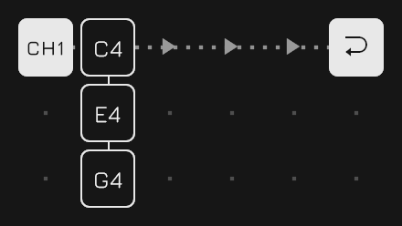

Stacks can contain more than notes. Parameter Lock tiles can be added to change
sound parameters for a particular step.

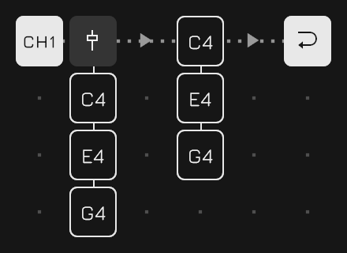

There are also conditional tiles that control whether other tiles in the stack
are triggered. For example, a Chance Gate can make a note play only 50% of the
time.

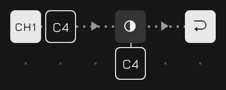

The order of tiles in a stack matters. A gate affects the tiles that follow it,
allowing different parts of the same stack to behave differently.

For example, C and E can play every time while G is triggered only 50% of the
time.

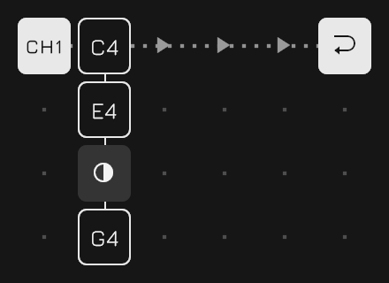

Cycle Gates add another kind of condition. They can trigger tiles only on
specific repetitions of the sequence, making it easy to create patterns that
change over several loops.

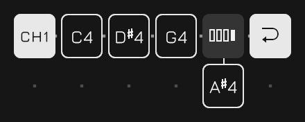

Sequences do not have to follow a straight path either. Jump tiles can redirect
playback to another position, creating branches and alternative routes through
a pattern.

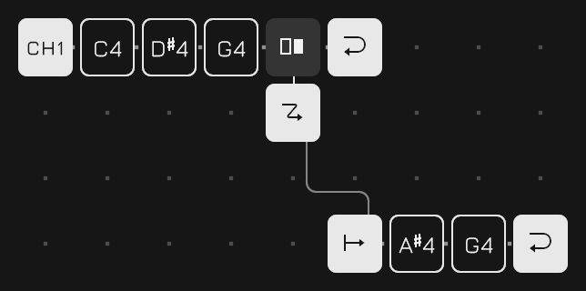

By combining stacks, parameter locks, gates, and jumps, a small grid can
produce sequences with much more structure and variation than a conventional
repeating pattern.

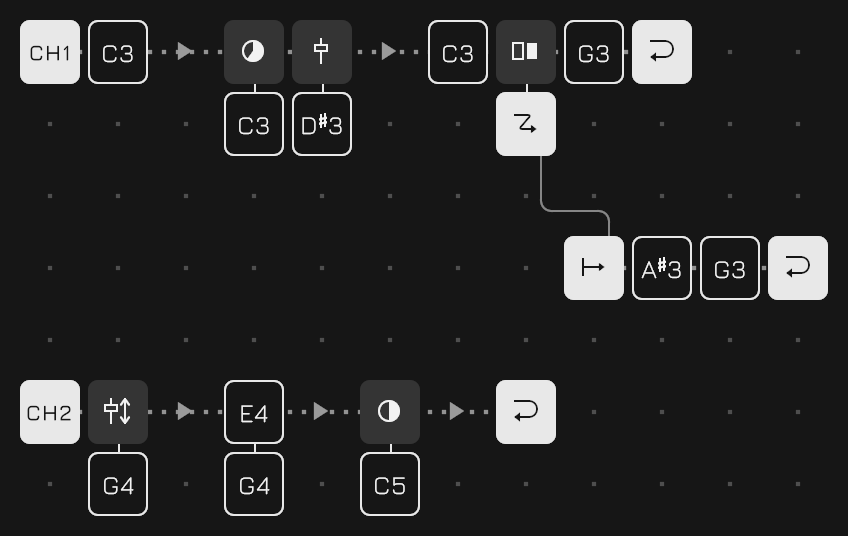

## Useful Tips

Double-click a tile to copy its entire stack to the copy buffer. Double-click
an empty slot to paste the buffered stack there.

This makes it quick to duplicate chords, parameter locks, or more complex
stacks without rebuilding them tile by tile.

When a score is already playing, pressing a Load button does not switch scores
immediately. Instead, the change is queued until the master lane reaches the
end of its loop.

This allows one score to transition into another without interrupting the
current phrase.

## Pro Tips

A single channel can contain multiple lanes. Each lane runs independently, so
they can have different lengths and serve different purposes.

One simple use is polyrhythm: lanes with different loop lengths gradually shift
against each other and create longer evolving patterns.

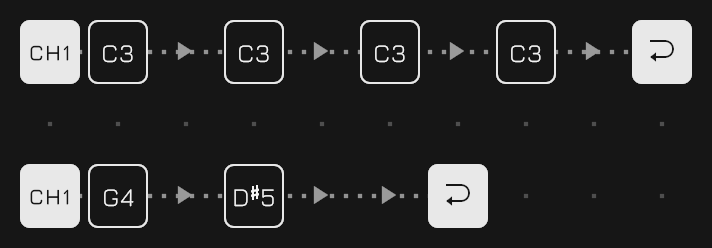

Another useful technique is to dedicate a lane to accents or other periodic
parameter changes.

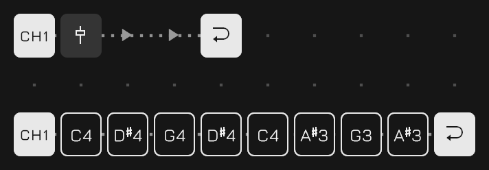

When multiple lanes exist in the same channel, they are applied from top to
bottom. This ordering is important when using Parameter Locks: a lane that
changes parameters should generally be placed above the lane whose notes use
those parameters.

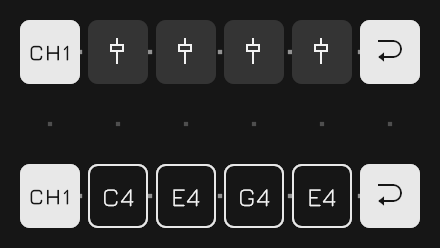

The first lane of Channel 1 has a special role: it is the **master lane**.

Its loop defines the synchronization boundary for the entire score. Queued
score changes are applied when the master lane loops, and it also determines
when newly started lanes begin playback.

In other words, the master lane acts as the musical clock for larger structural
changes, making it possible to switch patterns and introduce parts while
keeping everything aligned.

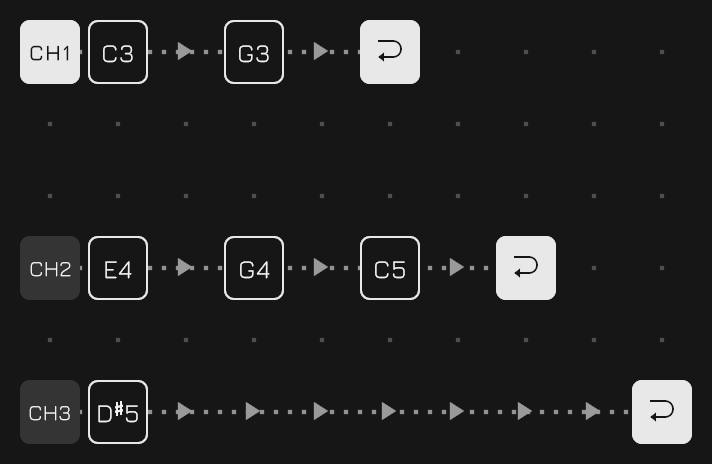

Every score is a plain text file in a single folder, and the folder can be
reached from outside the app. On desktop, the **Open score folder** button on
the System panel reveals it in the file manager. On iOS, the same folder appears
in the Files app under On My iPhone (or On My iPad), as Jacquard's own folder.

From there scores can be copied, renamed, backed up, or moved between devices.
A file dropped into the folder simply appears in the score list, since the list
is that folder read out rather than anything the app remembers.

## Make It Your Own

Jacquard was developed entirely with Unity and Claude Code, and everything
needed to understand and modify the project is included in this repository.

That means you don't have to stop at the features provided here. You can add
new tile types, change the sequencing rules, extend the sound engine, redesign
the interface, or take the project in a completely different direction.

If you find something missing—or simply want something to work
differently—don't hesitate to change it.

Make Jacquard your own.
