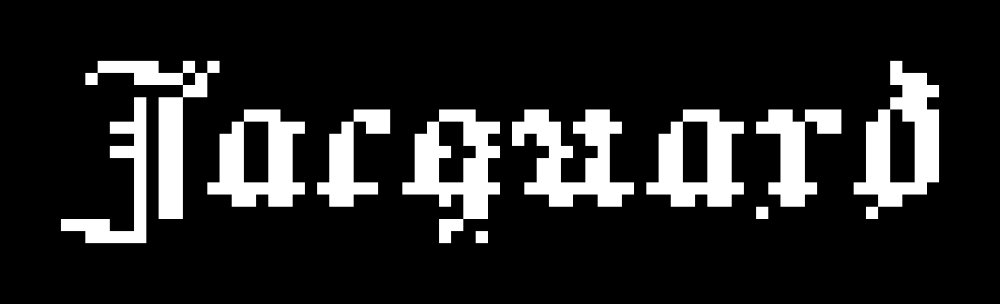

Jacquard
========

A prototype grid sequencer. Lanes of steps are laid out anywhere on one plane; a
step stacks what happens at the same instant; gates, parameter locks and jumps
turn sixteen slots into something that changes as it repeats.

Built with Unity 6.5 (6000.5.8f1). Open the project and play `Assets/Main.unity`.

The synth runs on the Scriptable Audio Pipeline, which the Web platform does not
support; there the same DSP is rendered from `Update` and pushed to the Web Audio
API instead, at the cost of about 110ms more latency before a note can sound.
Nothing else differs, and no setting selects it.
